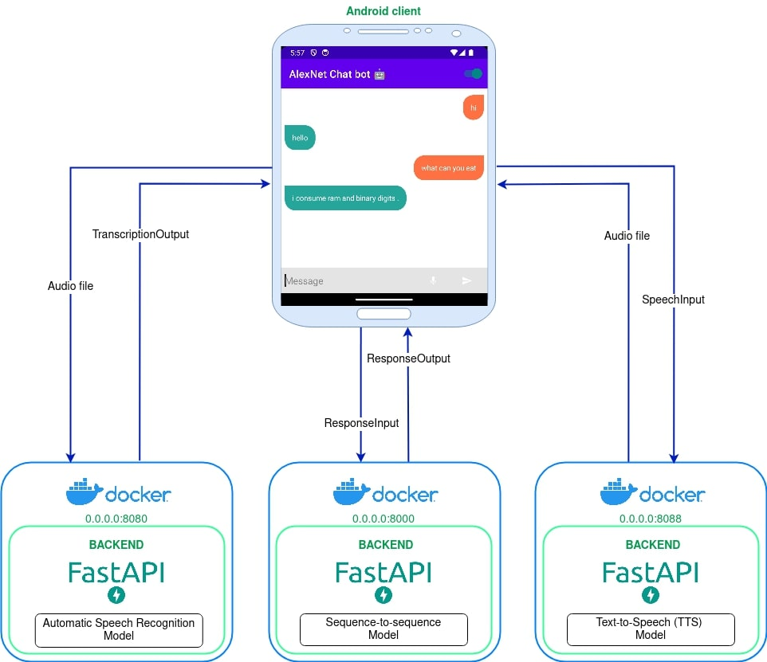
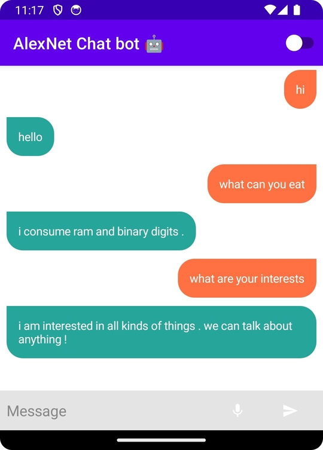
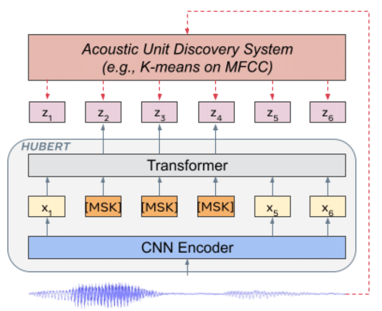
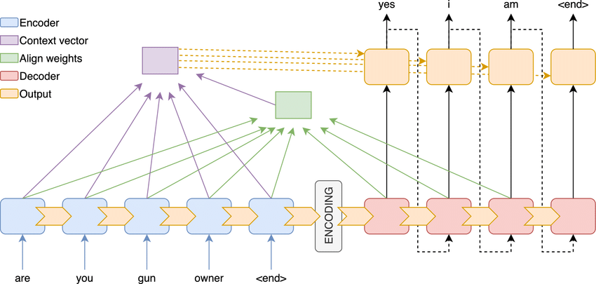
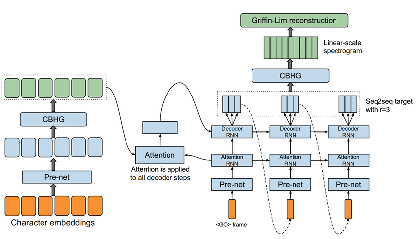

# AlexNet Chat bot app
Simple chat bot application

## Applicaton architecture

## Application components

### Android client
Uses all ML modules:
- ASR module to convert speech to text
- Seq2Seq module to generate text response
- TTS module to generate speech audio for generated response

### ASR module
HuBERT
- HUBERT_ASR_XLARGE
- pre-trained on 60,000 hours of unlabeled audio from Libri-Light dataset
- fine-tuned for ASR on 960 hours of transcribed audio from LibriSpeech dataset

### Seq2Seq module
Encoder-Decoder with Attention-based mechanism

### TTS module
Tacotron trained on LJ Speech Dataset

